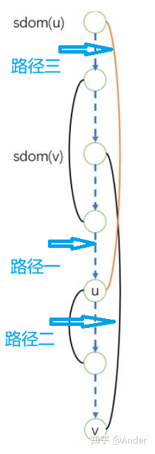

# 前言
构建 SSA 的过程中需要进行支配分析，而支配分析依赖于支配树的构造。本篇博客将介绍常见的几种构造支配树的方法，重点介绍 Lengauer-Tarjan 算法。

由于在网上关于 LT 算法的大部分帖子都只有算法原理和各种公式，所以在我自己的贴子里我想更多的用~~大白话~~简单易懂的解释整个算法以及介绍一下我实现的过程中的一些经验。

**声明：部分图片源自于知乎**。

## 一些概念
在有向图 $D$ 中，选定一个源节点 $s$ 和一个目标节点 $v$。对 $D$ 进行 DFS 生成的树为 $T$。

**DFS 序 (dfn)** : 在对流图进行深度优先搜索（DFS）时，每个节点被访问到的顺序编号。本文通篇记作 $dfn(u)$。$dfn$ 值越小，代表该节点在 DFS 树中越靠近根节点。$u \lt v$ 当且仅当 $dfn(u) < dfn(v)$。

**支配关系**：如果 $s$ 到 $v$ 的所有路径均经过 $u$，则称 $u$ 支配 $v$，记作 $u\;dom\;v$。支配关系**具有传递性**。

**严格支配**：如果 $u$ 支配 $v$ 且 $u \ne v$，则称 $u$ **严格支配** $v$。

**直接支配**：如果 $u$ 严格支配 $v$，且不存在节点 $w$ 满足 $u$ 严格支配 $w$ 且 $w$ 严格支配 $v$。此时称 $u$ 是 $v$ 的**直接支配节点**，记作 $u=idom(v)$。

**支配树**：以直接支配关系构成的树。如果 $u=idom(v)$，则在支配树中存在一条从 $u$ 到 $v$ 的边。

## 一些其他的常见的构造支配树的算法
### 节点删除法：
* 依次删除 $D$ 中的顶点，若删除后从 $s$ DFS 遍历整个图发现有一些节点不可达，则这些节点被删掉的顶点支配。
* 时间复杂度：$O(N ^ 3)$
### 数据流迭代法：
* 此方法基于如下定理：**一个点的支配点的点集为它所有前驱结点的支配点集的交集，再并上它本身．**。用 $\LaTeX$ 表示为：

$$
Dom(n) = \{n\} \cup (\bigcap_{p \in pred(n)} Dom(p))
$$

其中 $pred(n)$ 是节点 $n$ 的所有前驱节点的集合。

算法开始时，我们会进行如下初始化：
*   $Dom(entry) = \{entry\}$
*   对于所有其他节点 $n \ne entry$，$Dom(n) = N$ (N为节点全集)

然后，我们不断迭代计算，直到所有节点的 $Dom$ 集合不再发生变化为止。

时间复杂度为 $O(N ^ 2)$。

# 基于并查集优化的 Lengauer-Tarjan [^1] 算法

[^1]: [Original Paper](https://dl.acm.org/toc/toplas/1979/1/1)

上述两种方法逻辑简单，但在处理复杂控制流图时时间开销将会暴增，所以在工业级编译器中，常用时间复杂度接近线性的 LT 算法。

## 半支配点 [^2]

[^2]: 关于半支配点更多的介绍：[OI Wiki](https://oi-wiki.org/graph/dominator-tree/#%E5%8D%8A%E6%94%AF%E9%85%8D%E7%82%B9)、[知乎](https://zhuanlan.zhihu.com/p/676478875)

LT 算法的核心是半支配点 (Semidominator) 。对于一个非根节点 $w$，其半支配点 $sdom(w)$ 的计算基于检查其所有前驱节点。

根据前驱节点 $v$ 与 $w$ 在 DFS 树中的关系，候选者分为两类。$sdom(w)$ 就是从这两类候选节点的并集中，选出 $dfn$ 最小的那个。其计算公式为：
$$
sdom(w) = \min_{dfn} \left( \{v \mid (v, w) \in E, dfn(v) < dfn(w) \} \cup \{sdom(u) \mid \exists (v, w) \in E, dfn(v) > dfn(w), u \text{ is an ancestor of } v \text{ (or } u=v) \} \right)
$$
其中 $E$ 是边的集合，$\min_{dfn}$ 表示取 $dfn$ 最小的节点。$w$ 在 DFS 树中的父节点 $p(w)$ 是第一类候选者中的一个。

这个公式的含义是：
*   **第一集合**: 考察 `w` 的前驱 `v`，如果 `v` 在 DFS 树中是 `w` 的祖先或者在更早遍历的子树中（即 `dfn(v) < dfn(w)`），那么 `v` 就是一个直接的候选者。
*   **第二集合**: 如果前驱 `v` 是 `w` 的后代（`dfn(v) > dfn(w)`），那么候选者不是 `v` 本身，而是 `v` 的某个祖先 `u` 的半支配点 `sdom(u)`。

算法通过逆 DFS 序（`dfn` 从大到小）计算 `sdom`，并用**并查集**来高效地找到第二集合中的最佳候选者。

# Python Implementation

原本是使用 Rust 来实现的，但出于可读性原因，这里使用 Python 。

## Data Structures

```python
dfn[v]      # vertex v → DFS number
rev[i]      # DFS number i → vertex
sdom[v]     # semi-dominator of v (vertex number)
idom[v]     # immediate dominator of v (vertex number)
father[v]   # parent of v in DFS tree
parent[v]   # parent of v in DSU (disjoint set union) forest
min[v]      # vertex with minimum sdom on path to DSU root
bucket[v]   # set of vertices whose semi-dominator is v
```

## DFS Numbering

```python
def dfs(src):
    visited.add(src)
    dfn[src] = dfn_cnt
    rev[dfn_cnt] = src
    dfn_cnt += 1

    for succ in cfg[src].successors:
        if succ not in visited:
            father[succ] = src
            dfs(succ)
```

简单，不做解释。

## DSU with Path Compression (FIND + QUERY)

```python
def find(u):
    """Path compression in DSU forest, maintaining min sdom on path."""
    if parent[u] == u:
        return u
    v = find(parent[u])
    if dfn[sdom[min[u]]] > dfn[sdom[min[parent[u]]]]:
        min[u] = min[parent[u]]
    parent[u] = v
    return parent[u]

def query(u):
    """Return the vertex with the smallest sdom on the path from u to its DSU root."""
    find(u)
    return min[u]
```

这是一个 **并查集** ，在沿并查集路径向上的过程中查询到 **已被挂载的路径上拥有最小 $sdom$ 的节点 (即 `min` )** ，同时进行路径压缩。

## Helper

```python
def vertex_with_smaller_dfn(u, v):
    """Return whichever vertex has the smaller DFS number."""
    return u if dfn[u] < dfn[v] else v
```

简单，不解释。

## Compute Semi-Dominators and Immediate Dominators

```python
def build_dom_tree(entry):
    # --- Initialization ---
    for v in all_vertices:
        parent[v] = v
        sdom[v]   = v
        idom[v]   = v
        min[v]    = v

    # --- Step 1: DFS ---
    dfs(entry)

    # --- Step 2: Process vertices in reverse DFS order ---
    for i in range(dfn_cnt - 1, 0, -1):   # skip the root (i=0)
        u = rev[i]

        # 2a. Compute sdom[u]
        for pred in cfg[u].predecessors:
            if pred not in visited:
                continue
            if dfn[pred] < dfn[u]:
                # pred is an ancestor in DFS tree
                sdom[u] = vertex_with_smaller_dfn(sdom[u], pred)
            else:
                # pred is a descendant; use DSU query
                v = query(pred)
                sdom[u] = vertex_with_smaller_dfn(sdom[u], sdom[v])

        # 2b. Add u to its semi-dominator's bucket
        bucket[sdom[u]].append(u)

        # 2c. Link u to its DFS parent in DSU forest
        parent[u] = father[u]

        # 2d. Evaluate idom for all vertices in father[u]'s bucket
        for v in bucket[father[u]]:
            idom[v] = query(v)
        bucket[father[u]].clear()

    # --- Step 3: Refine idom ---
    for i in range(dfn_cnt):
        v = rev[i]
        u = idom[v]
        if sdom[u] != sdom[v]:
            # A vertex with a lower DFS number dominates v → chase up
            idom[v] = idom[u]
        else:
            # sdom[u] is the immediate dominator
            idom[v] = sdom[u]

    # --- Step 4: Export dominator tree ---
    dom_tree = {v: [] for v in all_vertices}
    for v in all_vertices:
        if idom[v] != v:
            dom_tree[idom[v]].append(v)

    return dom_tree
```

步骤：
1. **初始化**：
    1.  `parent` : 每个节点最初在 DSU 森林中均为孤立节点。
    2.  `sdom` : 根据定义， $sdom(v)$ 必然是比 $v$ 的 $dfn$ 小的节点，所以初始化为 $v$ 是**天然的上界**。
    3.  `idom` ：同上。
    4.  `min` ：同上。
2. **DFS**: 为每个节点进行 DFS 序编号，更新 `dfn` 和 `rev`。
3. **计算 $sdom$** ：逆 DFS 序遍历，从叶子节点开始处理，保证数据依赖的正确性。当处理到某一个节点时，遍历所有前驱节点，寻找 $sdom$ 。
    1. 根据定义，分成两个集合：
        1. **第一集合**: 考察 `v` 的前驱 `pred`，如果 `pred` 在 DFS 树中是 `v` 的祖先或者在更早遍历的子树中 (即 `dfn(pred) < dfn(v)`) ，那么 `pred` 就是一个直接的候选者。
        2. **第二集合**: 如果前驱 `pred` 是 `v` 的后代（`dfn(pred) > dfn(v)`），那么候选者不是 `pred` 本身，而是 `pred` 的某个祖先 `u` 的半支配点 `sdom(u)`。这里就需要使用到并查集搜索 `min` 。
            > 当处理到当前节点时，**所有 $dfn$ 比当前节点大的节点都已经计算好了 $sdom$ ，我们只需要找到在旁路中跟 $v$ 连通的拥有最小 $sdom$ 的节点即可**。

    2. 取两个集合中最小的一个即可。然后将当前节点 $v$ 加入 $sdom(v)$ 的桶中，等待进一步处理。
    3. **将节点挂载至 DSU 森林**：前面说到，最初每个节点都是孤立的，因此我们要把节点首先连接到 DFS 树中当前节点的父节点上，才能进行路径压缩。
    4. **清空桶** ：遍历桶内所有节点，使用并查集更新该节点的 `min` ，并将 `min` 存储到 `idom` 中。
        >这一步事实上是在找到在 DFS **主路径**上跟 $v$ 连通的拥有最小 $sdom$ 的节点。$u$ 一定是在DFS树 $sdom(v)$ 到 $v$ 路径上的节点。因为 Link 的时候**就是沿着 DFS 树的路径不断挂载新的节点的，所以并查集查找到的节点一定在主路径上**。
        >
        > 在这一步里我们并没有真的算出节点真正的 $idom$ ，**而是 新的 `min`** 。实际上， **`min` 的查找是一个动态的过程，随着处理过程推进，同一个节点的 `min` 只会越来越小**。
        >
        > 同时我们还能注意到一件事情：那就是我们处理的是**父节点的桶，而不是节点自己的桶**。这是因为我们在处理桶之前就挂上了父节点：如果此时处理节点自己的桶，那么 DSU 就会一直查找到父节点，**这导致了数据的不同步**，所以为了保持一致性，我们处理父节点的桶。
        >
        >实际上处理自己的桶也是可以的，但这需要我们**将挂载的步骤延迟至桶清空以后**。
4. **修正 $idom$** ：正 DFS 序遍历节点，比较 $sdom(v)$ 到 $v$ 上拥有最小 $sdom$ 的节点 (即目前的 $idom(v)$) ：
    1. 若 $sdom(u) \neq sdom(v)$ ，那么 $sdom(u)$ 能从 $dfn$ 更低的地方跳到 $v$，所以我们必须修正到 $sdom(u)$。然而修正到 $sdom(u)$ 仍然不够：**对于 $u$ 来说，也可能有另外一个点 $w$ ，使得 $sdom(w)$ 能从 $dfn$ 更低的地方跳到 $u$**。因此我们直接修正到最后的 $idom(u)$。
    2. 若 $sdom(u) = sdom(v)$ ，那么说明没有另外一个点 $w$ ，使得 $sdom(w)$ 能从 $dfn$ 更低的地方跳到 $u$，所以我们使用原来的 $sdom(v)$ (即 $sdom(u)$ ) 。

    正 DFS 序遍历同样是为了保证数据依赖的正确性。当计算到 $v$ 时，$u$ 的 $idom$ 已经被计算好了，所以 $idom(v)$ 才能被正确赋值。

## Complexity

- **时间复杂度:** $O(N \alpha (N))$ 。$\alpha$ 是反阿克曼函数，在全宇宙范围内 $\alpha(N) \le 4$ ，可被视作常数。
- **空间复杂度:** $O(N)$

# How does it work

LT 算法的核心定理（Theorem 4 in the original paper）是基于**半支配(Semidominator)** 的性质来分类的：
$$
idom(v) = \begin{cases}
  sdom(v) & \text{if } sdom(u) = sdom(v) \\
  idom(u) & \text{if } sdom(u) < sdom(v)
\end{cases}
$$

所以，$sdom$ 是 $idom$ 的 Candidate。找 $idom$ 的方法非常简单：就是找到**最小的可以达到 $v$ 的 $sdom$ 。这个 $sdom$ 可以是任何节点的 $sdom$**。


如图所示


从 $s$ 到达 $v$ 有三种途径：
* 路径一：直接通过 DFS 上的主路径来到达 $v$ 。
* 路径二：$sdom(v)$：能够直接"空降"到 $v$ 的节点。
* 路径三：某些节点的 $sdom(v)$ 虽然不能直接"空降"到 $v$，但可以空降到 $v$ 的**某个祖先**，通过祖先再到达 $v$。这就是为何我们还要搜寻 $sdom(v)$ 到 $v$ 上拥有最小 $sdom$ 的点。

$sdom(v)$ 的计算事实上解决了前面两种情况，而最后一种情况在清空桶和最后的修正循环中解决。

# 后记
这是我第一次接触到 OI 级别难度的算法... 还是花了几天时间好好琢磨的。

由于 LT 算法这块需要解释的地方较多，所以我才单独分出来写这个部分。

下一篇博客会继续介绍完整的 SSA 构建和最后 Mem2Reg 的流程。
